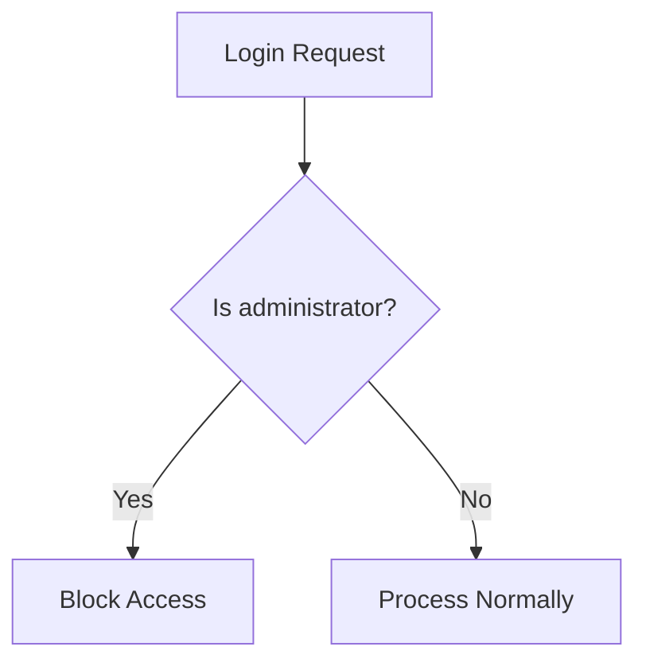

# Block Administrator 🛡️

A security enhancement app for Frappe Framework that blocks login attempts to the administrator account when email-password login method is enabled.

## 📋 Table of Contents
- [Features](#features)
- [Installation](#installation)
- [Usage](#usage)
- [How It Works](#how-it-works)
- [Credits](#credits)
- [Contributors](#contributors)
- [License](#license)

## Features
- ✅ Prevents unauthorized access to administrator account
- ✅ Compatible with Frappe Framework
- ✅ Simple setup with zero configuration
- ✅ Enhanced security for email-password authentication

## Installation

```bash
bench get-app https://github.com/username/block_administrator
bench --site your-site.com install-app block_administrator
```

## Usage

Once installed, the app automatically blocks login attempts to the administrator account when email-password login method is enabled. This adds an extra layer of security to your Frappe installation.

<details>
<summary>Why block the administrator account?</summary>
<br>
The administrator account has full system access. When email-password authentication is enabled, it becomes a high-value target for brute force attacks. This app helps mitigate that risk by preventing direct login to the administrator account.
</details>

## How It Works

The app hooks into Frappe's authentication system and implements the following security logic:

| Login Attempt | Result | Reason |
|--------------|--------|--------|
| Administrator account | 🚫 Blocked | Security risk |
| Other accounts | ✅ Allowed | Normal operation |



## Credits

This app is built on top of the [Frappe Framework](https://frappeframework.com), an open-source, metadata-driven framework created by Frappe Technologies. Special thanks to:

- The [Frappe Team](https://frappe.io/team) for developing and maintaining the framework
- The [Frappe Community](https://discuss.frappe.io) for their continued support

### How to Contribute

We welcome contributions! Here's how you can help:

1. Fork the repository
2. Create a feature branch (`git checkout -b feature/amazing-improvement`)
3. Make your changes
4. Commit your changes (`git commit -am 'Add some feature'`)
5. Push to the branch (`git push origin feature/amazing-improvement`) 
6. Create a new Pull Request

## License

MIT