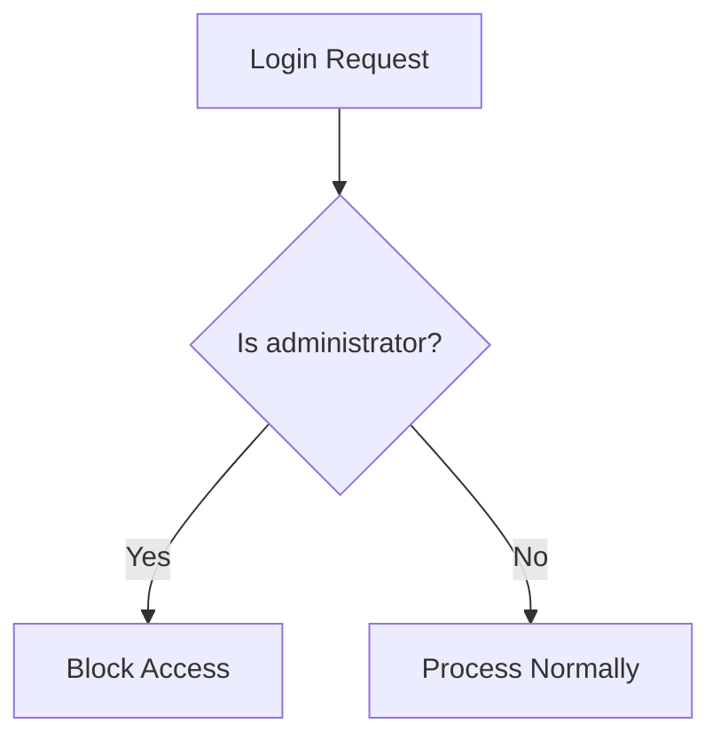

# Block Administrator 🛡️

A security enhancement app for Frappe Framework that blocks login attempts to the administrator account when email-password login method is enabled.

## 📋 Table of Contents
- [Features](#features)
- [Usage](#usage)
- [How It Works](#how-it-works)
- [Credits](#credits)
- [Contributors](#contributors)
- [License](#license)

## Features
- ✅ Prevents unauthorized access to administrator account
- ✅ Compatible with Frappe Framework
- ✅ Simple setup with zero configuration
- ✅ Enhanced security for email-password authentication

## Requirements

This app is compatible with Frappe v16.

## Usage

After installing the app, go to **System Settings → Login** and check **Block Administrator Login**
(the setting sits right below *Disable Username/Password Login* or should be in the Advanced Tab). When enabled, the built-in Administrator account can no longer log in with an email and password. Unchecking it re-enables the login immediately. Current logged in sessions of the administrator account will not be affected by this setting.

Why block the administrator account?

 
The administrator account has full system access. When email-password authentication is enabled, it becomes a high-value target for brute force attacks. This app helps mitigate that risk by preventing direct login to the administrator account.

## How It Works

The app hooks into Frappe's authentication system and implements the following security logic:

| Login Attempt | Result | Reason |
|--------------|--------|--------|
| Administrator account | 🚫 Blocked | Security risk |
| Other accounts | ✅ Allowed | Normal operation |

```mermaid
graph TD
    A[Login Request] --> B{Is administrator?}
    B -->|Yes| C[Block Access]
    B -->|No| D[Process Normally]
```

## Credits

This app is built on top of the [Frappe Framework](https://frappeframework.com), an open-source, metadata-driven framework created by Frappe Technologies. Special thanks to:

- The [Frappe Team](https://frappe.io/team) for developing and maintaining the framework
- The [Frappe Community](https://discuss.frappe.io) for their continued support
