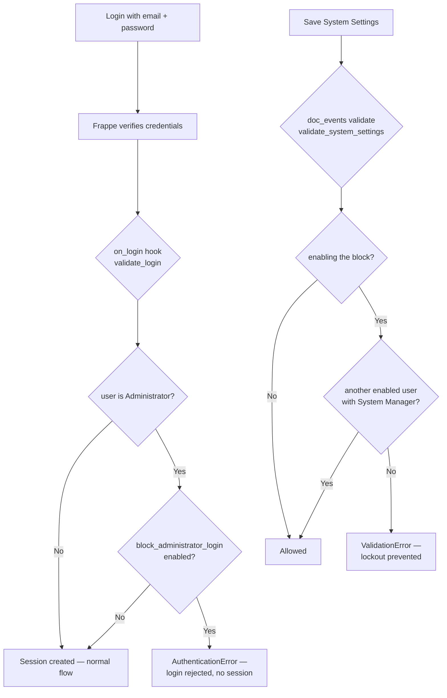

# Block Administrator 🛡️

Stop the built-in `Administrator` account on your Frappe site from logging in with an email and password — **one checkbox, enforced server-side, lockout-proof.**

The built-in `Administrator` account is the most valuable default credential on every Frappe installation. This app removes it from the email-password attack surface entirely.

## 📋 Table of Contents
- [Features](#features)
- [Requirements](#requirements)
- [Installation](#installation)
- [Usage](#usage)
- [Lockout protection](#lockout-protection)
- [How It Works](#how-it-works)
- [Architecture](#architecture)
- [Tests](#tests)
- [Version support](#version-support)
- [Credits](#credits)
- [License](#license)

## Features
- ✅ Blocks `Administrator` email/password login when enabled
- ✅ **Pure server-side** — `on_login` session hook, zero client-side JS, zero DOM hacks
- ✅ **Lockout-proof** — refuses to enable if no other enabled System Manager exists
- ✅ Install-time custom field with anchor fallback; patch ships upgrades from v15
- ✅ Existing `Administrator` sessions are never interrupted
- ✅ Works with **Frappe v16**

## Requirements
- **Frappe v16** (bench)

## Installation

```bash
bench get-app https://github.com/iamimmanuelraj/block_administrator --branch version-16
bench --site your-site.com install-app block_administrator
```

> Using the `develop` branch? Same code — `develop` is the v16 line with nightly CI.

## Usage

1. Install the app (above).
2. Go to **System Settings → Login**.
3. Check **Block Administrator Login** — it sits right below *Disable Username/Password Login*, or on the Advanced tab.
4. Save. The `Administrator` account can no longer log in with an email and password. Unchecking re-enables login immediately.

Current logged-in sessions of the `Administrator` account are **not** affected by this setting — only future logins are blocked.

<details>
<summary>Why block the administrator account?</summary>
<br>
The `Administrator` account has full system access. When email-password authentication is enabled, it becomes a high-value target for brute-force attacks. This app mitigates the risk by preventing direct login to the account — without disabling email-password login for everyone else.
</details>

## Lockout protection

You **cannot** lock yourself out. Enabling the block is rejected unless at least one *other* enabled user holds the **System Manager** role, so a recovery path always exists.

```
Cannot block Administrator login as no other enabled user has the
System Manager role. You would lose all admin access.
```

Disabling the block (or saving unrelated settings) is always allowed.

## How It Works


```mermaid
flowchart TD
    A[Login with email + password] --> B[Frappe verifies credentials]
    B --> C{on_login hook<br/>validate_login}
    C --> D{user is Administrator?}
    D -->|No| E[Session created — normal flow]
    D -->|Yes| F{block_administrator_login<br/>enabled?}
    F -->|No| E
    F -->|Yes| G[AuthenticationError —<br/>login rejected, no session]

    H[Save System Settings] --> I{doc_events validate<br/>validate_system_settings}
    I --> J{enabling the block?}
    J -->|No| K[Allowed]
    J -->|Yes| L{another enabled user<br/>with System Manager?}
    L -->|Yes| K
    L -->|No| M[ValidationError —<br/>lockout prevented]
```

The `on_login` hook runs **after** credentials are verified but **before** the session is created — a blocked login fails cleanly with an `AuthenticationError` and leaves no session behind.

## Architecture

The v16 line is a full server-side rewrite of the v15 approach. No DocType, no client script — everything lives in four small modules:

| Module | Responsibility |
|--------|----------------|
| `install.py` | Creates the `block_administrator_login` Check **custom field** on System Settings at install. `insert_after` resolves against live metadata (`disable_user_pass_login` → `login_methods_section` → `deny_multiple_sessions` → `session_expiry`), falling back to `append` so it never breaks on future Frappe changes |
| `auth/__init__.py` | `validate_login(login_manager)` — the `on_login` hook. Rejects `Administrator` logins when the setting is on; bails out gracefully if the custom field hasn't synced yet |
| `validations.py` | `validate_system_settings(doc)` — the `doc_events` guard that prevents enabling the block when no other enabled System Manager exists |
| `patches/v1_0_0/` | Migration patch that adds the custom field to existing installs (e.g. upgrading from v15) |

| Hook | Type | Purpose |
|------|------|---------|
| `on_login` | Session hook | Blocks `Administrator` login post-verification, pre-session |
| `doc_events` → `System Settings.validate` | Document event | Lockout guard on enable |
| `after_install` | Install hook | Creates the custom field |

**Why this design?** The v15 approach injected the checkbox into the System Settings form with client-side JS and stored state in a singleton DocType — fragile against Frappe UI changes and bypassable at the framework layer. The v16 rewrite is declarative: a real custom field, a session-level hook, and server-side validation only.

## Tests

`block_administrator/tests/test_block_administrator.py` — integration tests covering:
- `test_blocks_administrator_login_when_enabled`
- `test_allows_administrator_login_when_disabled`
- `test_blocks_toggling_on_without_other_system_managers`

```bash
bench --site your-site.com run-tests --app block_administrator
```

## Version support

| Branch | Frappe | Mechanism | Status |
|--------|--------|-----------|--------|
| `version-16` | v16 | Server-side custom field + `on_login` hook | Current |
| `develop` | v16 | Same + nightly CI | Current |
| `version-15` | v15 | Injected checkbox + singleton DocType + auth hook | Legacy |

> **Migrating from v15:** the v1_0_0 patch adds the custom field and the value is carried over from the old `Block Administrator` singleton — uninstall `version-15` and install `version-16` on the same site.

## Credits

Built on the [Frappe Framework](https://frappeframework.com), the open-source, metadata-driven framework created by Frappe Technologies.

## License

MIT
