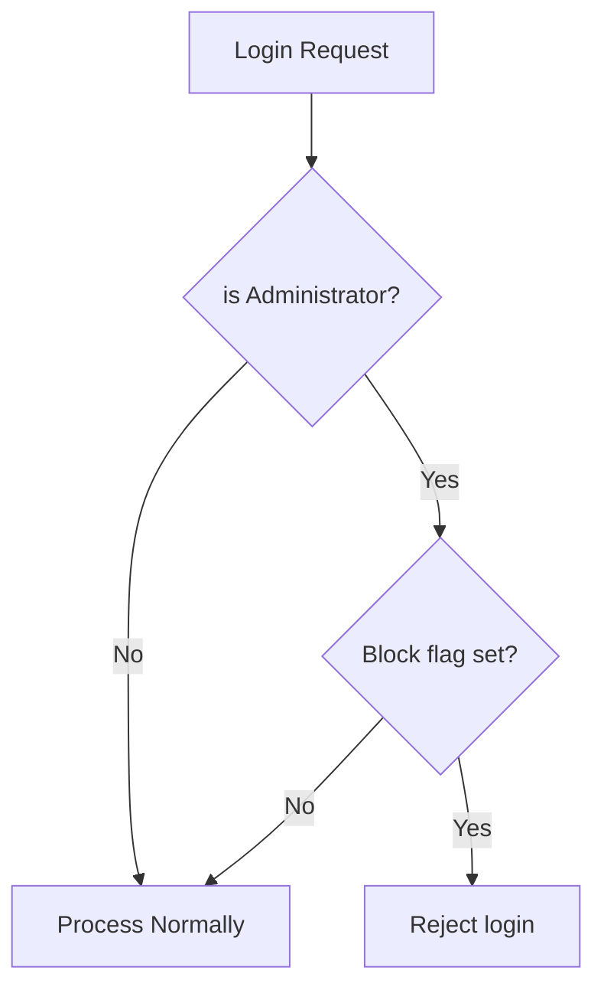

# Block Administrator 🛡️

A security app for **Frappe v15** that blocks login to the built-in `Administrator` account when email-password login is enabled.

> ⚠️ **Legacy branch.** This branch targets the original client-side implementation. The rewritten, server-side version lives on the `version-16` and `develop` branches — see [Version support](#version-support).

## 📋 Table of Contents
- [Features](#features)
- [Requirements](#requirements)
- [Installation](#installation)
- [Usage](#usage)
- [How It Works](#how-it-works)
- [Version support](#version-support)
- [Credits](#credits)
- [License](#license)

## Features
- ✅ Blocks `Administrator` email/password login when enabled
- ✅ Server-side enforcement via Frappe auth hook
- ✅ Toggle right from **System Settings** — zero extra configuration
- ✅ Existing Administrator sessions are never interrupted

## Requirements
- Bench with **Frappe v15**

## Installation

```bash
bench get-app https://github.com/iamimmanuelraj/block_administrator --branch version-15
bench --site your-site.com install-app block_administrator
```

## Usage

Once installed, open **System Settings**. The app injects a **Block Administrator Login** checkbox (right below *Disable Username/Password Login*). Check it and save — the `Administrator` account can no longer log in with an email and password. Uncheck to re-enable immediately.

<details>
<summary>Why block the administrator account?</summary>
<br>
The `Administrator` account has full system access. When email-password authentication is enabled, it becomes a prime target for brute-force attacks. This app removes that attack surface by preventing direct login to the account.
</details>

## How It Works

The v15 implementation has two parts:

| Layer | Mechanism |
|-------|-----------|
| Client | `doctype_js` on **System Settings** injects the checkbox into the form and persists its state to the `Block Administrator` singleton DocType (`frappe.db.set_value`) |
| Server | `auth_hooks` → `validate()`: if the session user is `Administrator` and the singleton's flag is set, login is rejected with a `PermissionError` |


```mermaid
graph TD
    A[Login Request] --> B{is Administrator?}
    B -->|No| D[Process Normally]
    B -->|Yes| E{Block flag set?}
    E -->|No| D
    E -->|Yes| F[Reject login]
```

## Version support

| Branch | Frappe | Mechanism | Status |
|--------|--------|-----------|--------|
| `version-15` | v15 | Injected checkbox + singleton DocType + auth hook | Legacy |
| `version-16` | v16 | Server-side custom field + `on_login` hook | Current |
| `develop` | v16 | Same as v16 + nightly CI | Current |

## Credits

Built on the [Frappe Framework](https://frappeframework.com), the open-source, metadata-driven framework from Frappe Technologies.

## License

[GPLv3](LICENSE) — see the LICENSE file for the full text.
